# Pryv → Microsoft Power BI integration

Custom data connector to import data from Pryv to Microsoft Power BI.

Warning: support for custom data connectors was only enabled in the [June release 2017](https://powerbi.microsoft.com/en-us/blog/power-bi-desktop-june-feature-summary/#dataConnectivity)

Power BI DataConector is still in **Preview**. New features will come from MS and frequent updates should be expected.
[Official MS SDK DataConnectors](https://github.com/Microsoft/DataConnectors)

## Content of this package

- **src/** Visual Studio source code
- **bin/** Binaries for installation
	- **Pryv.mez** The plugin to import data from Pryv
	- **PryvCustomConnectorDemoReport.pbix** A sample custom report
- **doc/** Ressources for this page 

## Install and usage

### Installing the custom data connector

- First of all, ensure that you have downloaded and installed the latest monthly release of Power BI Desktop. The custom data connector has been tested with the 64-bit version of the September 2017 release:
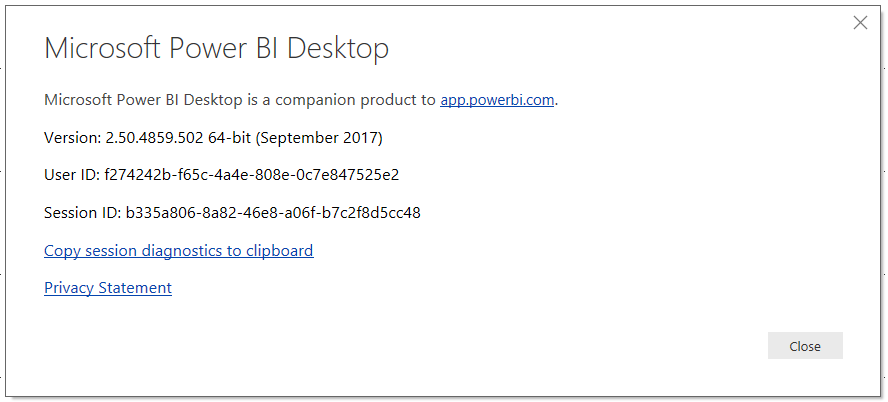

- Next, in Power BI Desktop, go to the File menu, click “Options and settings” and then “Options”
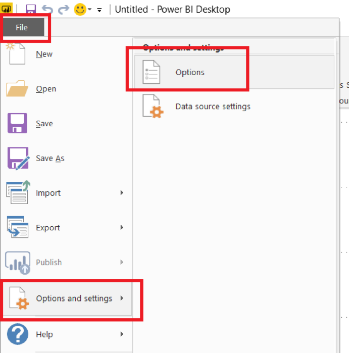

- On the “Preview features” pane of the Options dialog, ensure that “Custom data connectors” is selected.
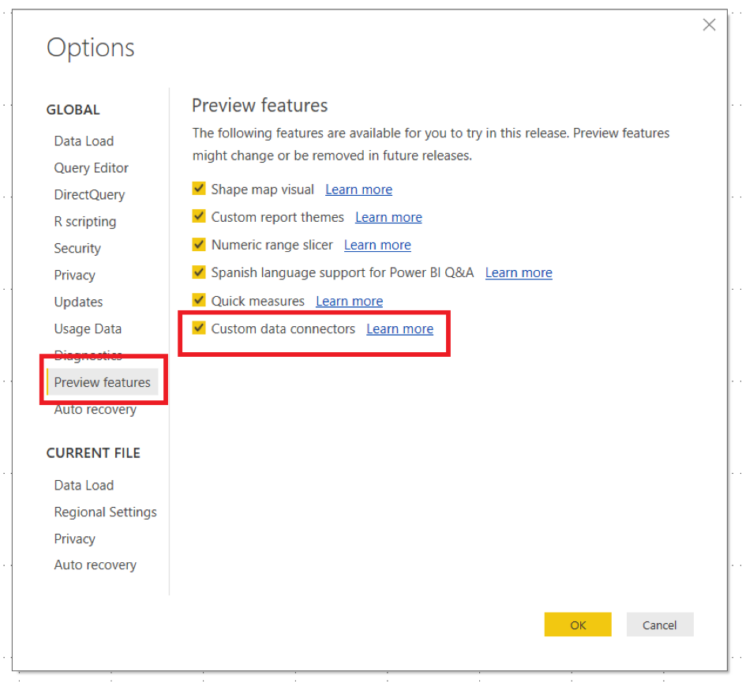

- Next, on your PC, create a folder under Documents called **“Microsoft Power BI Desktop”** and then create a folder called **“Custom Connectors”**. The full path should be:
`C:\Users\YourUserName\Documents\Microsoft Power BI Desktop\Custom Connectors`
- Copy the file [bin/Pryv.mez](https://github.com/pryv/poc-integration-powerbi/raw/master/bin/Pryv.mez) into this new folder
- Restart Power BI Desktop if it is already open, and you will be ready to use the custom data connector

### Using the custom data connector from the Get Data dialog

- In Power BI Desktop, click **“Get Data”** and then click **“More”**:
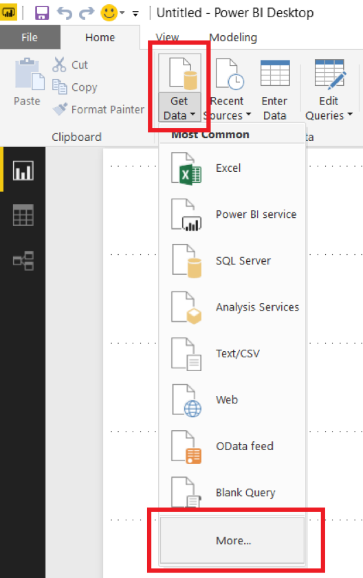

- Click “Other” and you should see Pryv listed. If you don’t there is a problem with the installation of the custom data connector. Click on Pryv to start importing data.
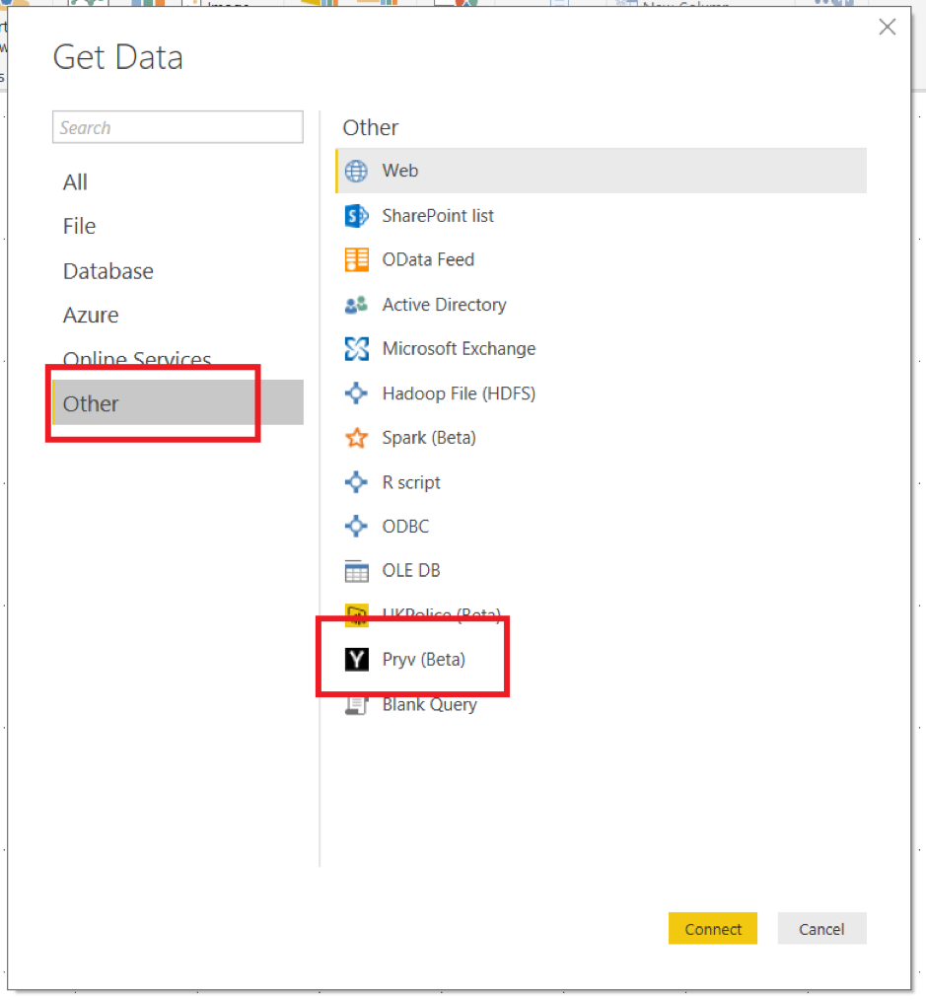

-	If you see a dialog warning you that this is a beta product, you can dismiss it
Next you’ll see a dialog box prompting you to select the URL for the server you wish to import data from (this will be in the format `https://{username}.{domain.tld}:443/#/sharings/{token}`), the date/time for the start of the date range and the end of the date range (this is in whatever your local date format is, for example `dd/mm/yyyy 00:00:00` – you can use the date picker to select a date, but any times need to be added manually) and a limit for the number of events imported from each stream. Only the URL has to be entered; all other parameters are optional.
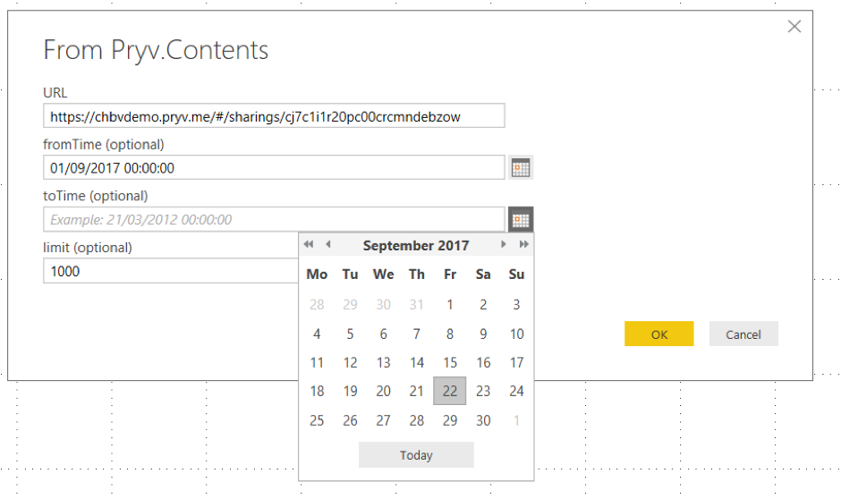

- Once you have entered your parameters, click OK and the dialog below will appear. Click Connect.
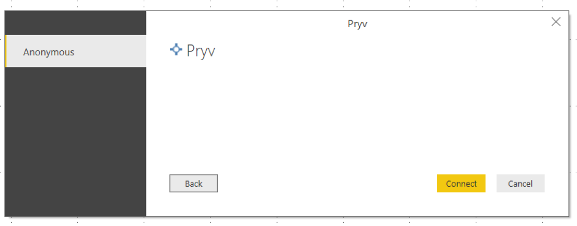

- Next, the following dialog will appear. Do not click Load, but instead click the Edit button:
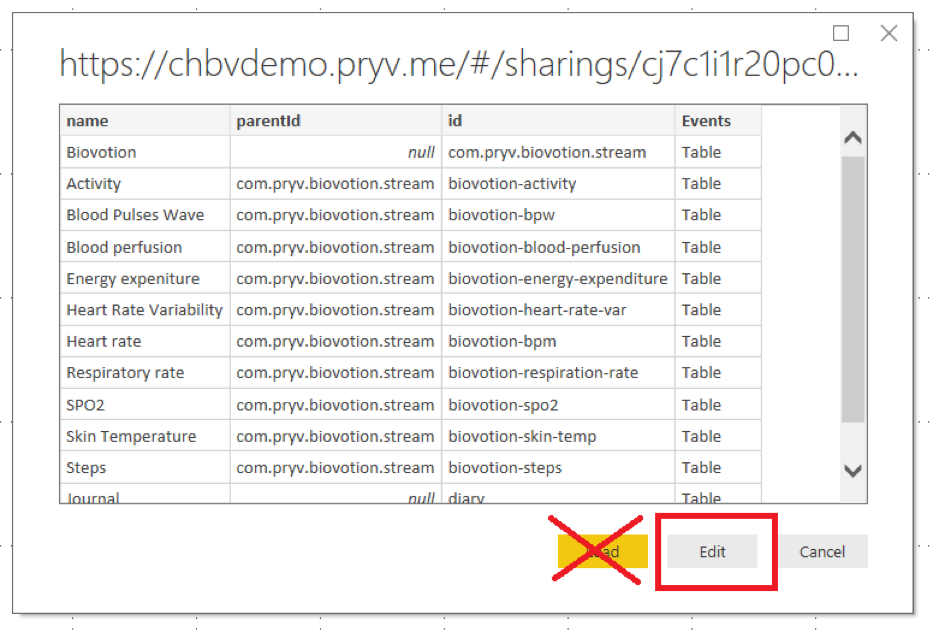

- The Query Editor window will now appear, and at this point you will see a query that returns all of the streams you can import data from, plus their IDs and the IDs of their parent in the stream hierarchy. Filter the streams down to just those that you want using any of the Query Editor’s filtering functionality:
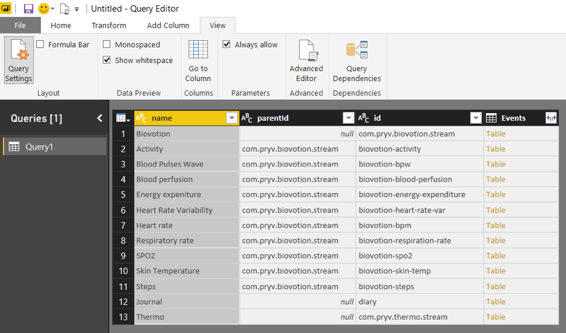
One way of filtering the streams is to click on the dropdown at the top of the name column and to select and deselect individual stream names.
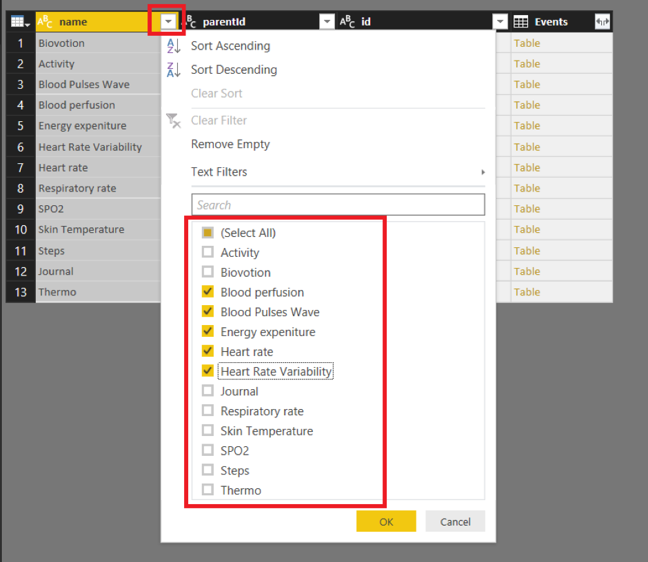

- To get the event data associated with each stream, click on the Expand/Aggregate icon on the right-hand side of the column header of the Events column:
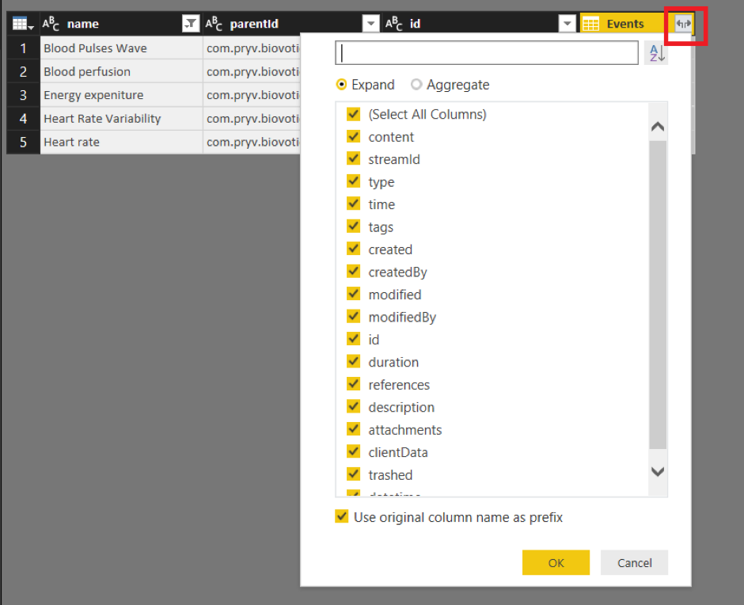

- In the Expand/Aggregate flyout window make sure you stay on the Expand pane and then select which columns you want to return for each event and click OK. Once you have done this the event data for each selected stream will be returned:
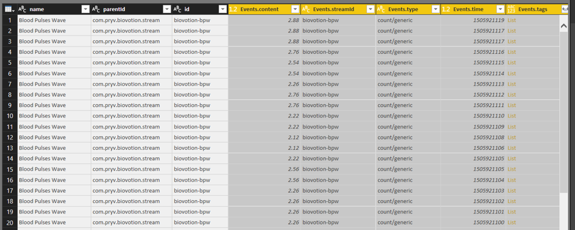

- From this point on you are free to use any of the functionality in the Query Editor window to transform your data. The sample report PryvCustomConnectorDemoReport.pbix contains several examples of this, including extracting date and time values into new columns and pivoting streams into new columns.
- When you have your data in the required format, click the Close & Apply button on the Home tab of the Query Editor window to load the data into Power BI and to start to build your report.

### M Functions

For advanced users, the custom data connector exposes three M functions. The query described in the previous section uses the Pryv.Contents() function to return a flattened table of streams which can be expanded to return event data. However it is also possible to use the Pryv.Streams() to get a table of streams (that has not been flattened and has its hierarchical structure intact) and the Pryv.Events() function to get a table of events for one or more streams. Examples of how these functions can be called can be found in the PryvCustomConnectorDemoReport.pbix sample file.

## Support and warranty

Pryv provides this software for educational and demonstration purposes with no support or warranty.

## License

[Revised BSD license](https://github.com/pryv/documents/blob/master/license-bsd-revised.md)

## Copyright
This software and source code is under Pryv SA Switzerland copyright.
